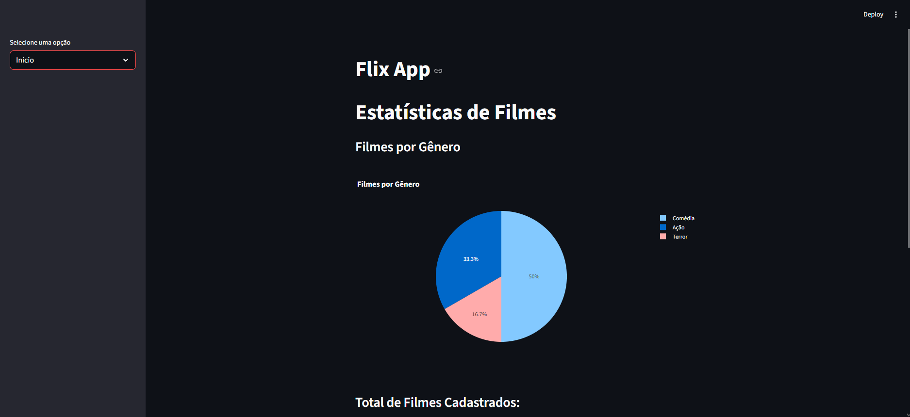

[Leia em Português](README.md)

# Flix App - Cinema Management System 🎬

This project is a complete Web application developed to manage a catalog of movies, actors, and reviews. It serves as the architectural foundation for the **SGE (Inventory Management System)**.

## 🚀 Technologies
* **Python** (Core language)
* **Streamlit** (Web Interface)
* **Pandas** (Data manipulation)
* **Plotly** (Statistical Dashboards)
* **Requests** (REST API consumption with JWT)

## 🏗️ Architecture
The project follows the **Separation of Concerns (SoC)** pattern, using the following layers:
* **Pages**: Streamlit interface and components.
* **Services**: Business logic and state management (session_state).
* **Repositories**: Direct API communication.

## 🛠️ How to run
1. Install dependencies: `pip install -r requirements.txt`
2. Run linter for PEP8 compliance: `flake8 .`
3. Launch the app: `streamlit run app.py`

---
*Status: Completed (Base for the SEINFRA SGE)*
